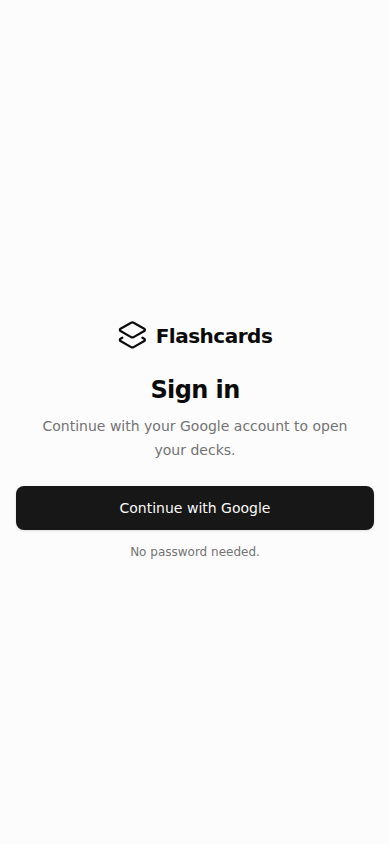
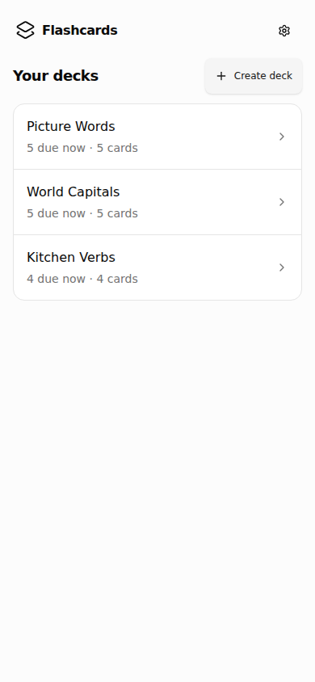
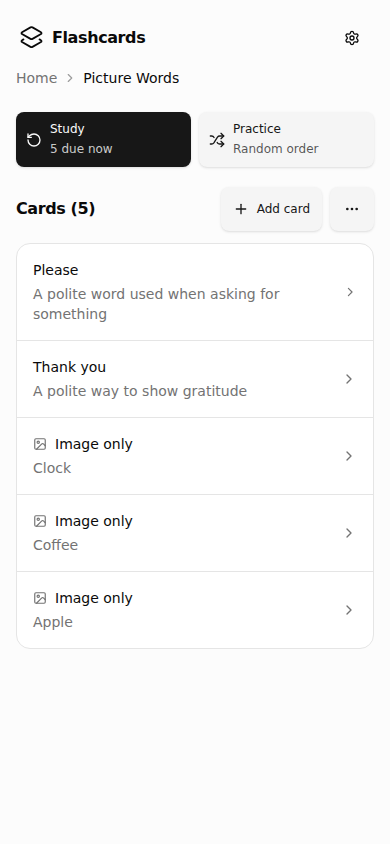
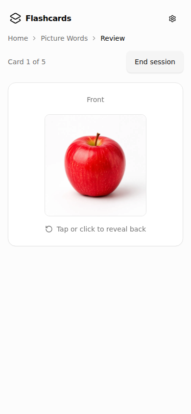
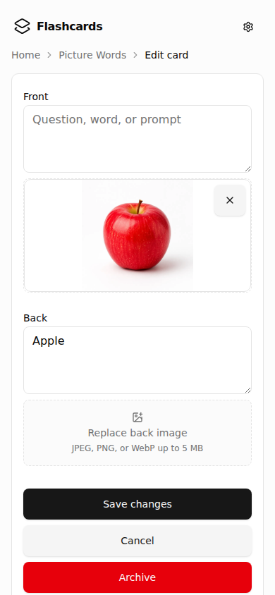

# Flashcards

Mobile-first spaced-repetition study PWA. Next.js App Router for the UI and same-origin APIs; Supabase Auth (Google OAuth) and Postgres for sessions and user-owned decks/cards; Drizzle for the schema and migrations. Private card images stay behind app routes, not public storage URLs.

<p align="center">
  
  
  
  
  
</p>

## What's here

| Area                | Path                                                 | Role                                                                                                        |
| ------------------- | ---------------------------------------------------- | ----------------------------------------------------------------------------------------------------------- |
| App routes & APIs   | `src/app/`                                           | Login, deck/card CRUD, study sessions, versioned image delivery, release metadata                           |
| Domain services     | `src/lib/`                                           | Decks, cards, SM-2-style scheduling, auth gates, mutation outcomes, navigation helpers, Supabase/DB clients |
| UI                  | `src/components/`                                    | Study session, card/deck forms, private-image loading, reliable forms, hierarchical navigation shell        |
| Schema & migrations | `src/lib/db/`, `drizzle/`                            | Postgres tables for decks, cards (SRS fields), reviews                                                      |
| Local backend       | `supabase/`                                          | Local Supabase config and storage policies for private flashcard images                                     |
| Specs               | `openspec/specs/`                                    | OpenSpec requirements (auth, card DB, PWA, private images, reliable mutations, app shell, UI)               |
| Decisions           | `docs/adr/`                                          | ADRs for images, SRS state, browser cache, navigation, mutations                                            |
| Product / design    | `PRODUCT.md`, `DESIGN.md`, `CONTEXT.md`              | Product register, “Quiet Study Desk” visual system, domain vocabulary                                       |
| Deploy              | `scripts/deploy.mjs`, `.github/workflows/deploy.yml` | `workflow_dispatch` migrate-then-deploy to Vercel                                                           |

Most of the custom work sits in study scheduling (`src/lib/study/`), private image delivery and caching (`src/lib/cards/`, `src/components/cards/`, `src/app/api/.../image/`), and reliable mutations / hierarchical navigation (`src/components/app/`, `src/lib/mutations/`, `src/lib/navigation/`). Auth, deck/card CRUD, PWA installability, and deploy make up the rest.

## Layout

```text
.
├── docs/adr/           # architecture decisions
├── drizzle/            # generated SQL migrations
├── openspec/           # specs + change proposals
├── public/             # PWA icons + README screenshots (readme/)
├── scripts/            # deploy + icon generation
├── src/
│   ├── app/            # App Router pages + /api
│   ├── brand/          # logo geometry
│   ├── components/     # study, cards, decks, app shell, ui
│   ├── lib/            # domain + infra modules
│   └── types/
└── supabase/           # local stack + storage policies
```

## Setup

```bash
npm install
npm run supabase:start   # local Auth + Postgres + Storage
npm run db:migrate
npm run dev              # http://localhost:3000
npm test                 # Vitest
```

Copy env from your local Supabase output into `.env.local` (URL, anon key, service role / DB URLs as used by the app). Production deploy: `npm run deploy` triggers `.github/workflows/deploy.yml`.
